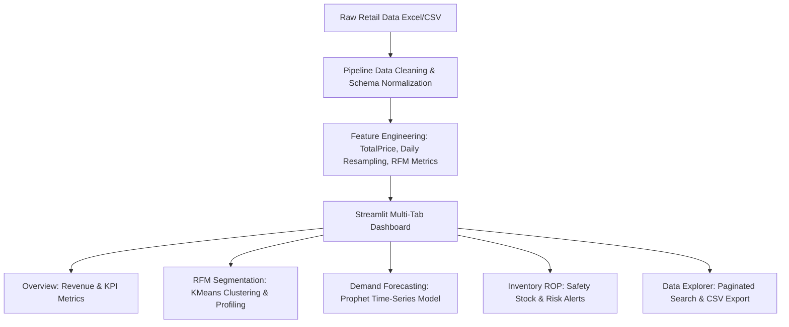

# 📈 NeuralRetail & RetailPulse: Enterprise AI Retail Analytics Platform

[](https://www.python.org/)
[](https://streamlit.io/)
[](https://scikit-learn.org/)
[](LICENSE)
[]()

> **NeuralRetail / RetailPulse** is an enterprise-grade, end-to-end Data Science, Machine Learning, and Business Intelligence web application built with **Python** and **Streamlit**. It transforms raw e-commerce transaction data into actionable decision-making metrics—enabling real-time KPI tracking, dynamic RFM customer segmentation, AI-powered time-series demand forecasting, and automated inventory stockout risk prevention.

---

## 🌟 Key Platform Features

### 📊 1. Executive Revenue & Sales Dashboard
- **Real-Time KPIs**: Monitor Total Revenue, Completed Invoices, Active Buyer Count, and Average Order Value (AOV).
- **Trend Visualizations**: Interactive daily revenue charts with 7-day moving averages (MA).
- **Geographic & Product Analysis**: Multi-country revenue distribution breakdown and top 10 products by volume and total spend.

### 👥 2. Dynamic RFM Customer Segmentation (K-Means)
- **RFM Metrics**: Computes **Recency** (days since last purchase), **Frequency** (order count), and **Monetary** (total spend).
- **Machine Learning Clustering**: Log-transforms skewed features and applies `StandardScaler` + `KMeans` clustering to group customers into actionable business tiers (*Champions 👑, Loyal / Recent 🌟, Potential / Core 🎯, At-Risk / Dormant ⚠️*).
- **Export Capabilities**: Interactive Plotly scatter maps and instant CSV export of customer segment allocations.

### 🔮 3. AI-Powered Demand Forecasting (Facebook Prophet)
- **Continuous Time-Series**: Aggregates daily transaction totals with zero-filling to handle non-trading days cleanly.
- **Dynamic Horizons**: Forecast 7, 14, 30, 60, or 90 days into the future for both **Revenue ($)** and **Order Volume (Invoices)**.
- **Contiguous Trend Views**: Integrated historical line transitioning into future projection curves with 80% confidence interval bands ($yhat_{lower}, yhat_{upper}$).

### 📦 4. Automated Inventory & Reorder Point (ROP) Planning
- **Sales Velocity**: Calculates average daily consumption rate per product over the historical span.
- **Safety Stock & ROP Calculation**: Automates Lead Time Demand and Safety Stock calculations based on statistical variance:
  $$\text{ROP} = (\text{Daily Velocity} \times \text{Lead Time}) + (Z \times \sigma_{\text{daily}} \times \sqrt{\text{Lead Time}})$$
- **Stockout Risk Indicators**: Automatically flags inventory items as **CRITICAL REORDER 🔴**, **WARNING ROP 🟡**, or **ADEQUATE 🟢**.

---

## 🏗️ System Architecture



---

## 📁 Repository Structure

```
ZidioDataScience/
├── NeuralRetail_app.py         # Main enterprise Streamlit web dashboard
├── RetailPulse.py              # Lightweight alternative Streamlit implementation
├── requirements.txt            # Python dependencies with version constraints
├── LICENSE                     # MIT Open Source License
├── README.md                   # Comprehensive platform documentation
├── data/
│   └── raw/
│       └── online_retail.xlsx  # Primary transaction dataset (~45.6 MB)
├── docs/
│   ├── neuralretail_demo.gif   # UI animation preview
│   └── neuralretail_preview.png # Dashboard screenshot preview
└── .streamlit_prefs.json       # Streamlit preferences config
```

---

## 🚀 Quickstart Guide

### Prerequisites
- Python 3.9+ installed on your system.
- Git (optional, for cloning).

### 1. Clone or Open the Repository
```bash
git clone https://github.com/your-org/NeuralRetail.git
cd NeuralRetail
```

### 2. Create and Activate a Virtual Environment
```bash
# On Windows
python -m venv .venv
.venv\Scripts\activate

# On macOS/Linux
python3 -m venv .venv
source .venv/bin/activate
```

### 3. Install Dependencies
```bash
pip install -r requirements.txt
```

### 4. Run the Streamlit Application
```bash
streamlit run NeuralRetail_app.py
```
After executing, Streamlit will automatically open `http://localhost:8501` in your browser.

---

## 🐳 Docker Deployment Guide

To deploy NeuralRetail using Docker:

### 1. Create a `Dockerfile` in the root directory:
```dockerfile
FROM python:3.11-slim

WORKDIR /app

RUN apt-get update && apt-get install -y \
    build-essential \
    curl \
    software-properties-common \
    && rm -rf /var/lib/apt/lists/*

COPY requirements.txt .
RUN pip install --no-cache-dir -r requirements.txt

COPY . .

EXPOSE 8501

HEALTHCHECK CMD curl --fail http://localhost:8501/_stcore/health

ENTRYPOINT ["streamlit", "run", "NeuralRetail_app.py", "--server.port=8501", "--server.address=0.0.0.0"]
```

### 2. Build and Run the Container
```bash
docker build -t neuralretail-app .
docker run -p 8501:8501 neuralretail-app
```

---

## 🌐 Deploying to Streamlit Community Cloud

1. Push this repository to **GitHub**.
2. Visit [share.streamlit.io](https://share.streamlit.io/).
3. Connect your GitHub account and click **New App**.
4. Select your repository, set **Main file path** to `NeuralRetail_app.py`, and click **Deploy**!

---

## 📄 License

This project is licensed under the **MIT License** - see the [LICENSE](LICENSE) file for details.

---

## 🤝 Contributing & Feedback

Contributions, issues, and feature requests are welcome! Feel free to open an issue or submit a Pull Request.

*Built for data-driven retail analytics and modern business decision-making.*
