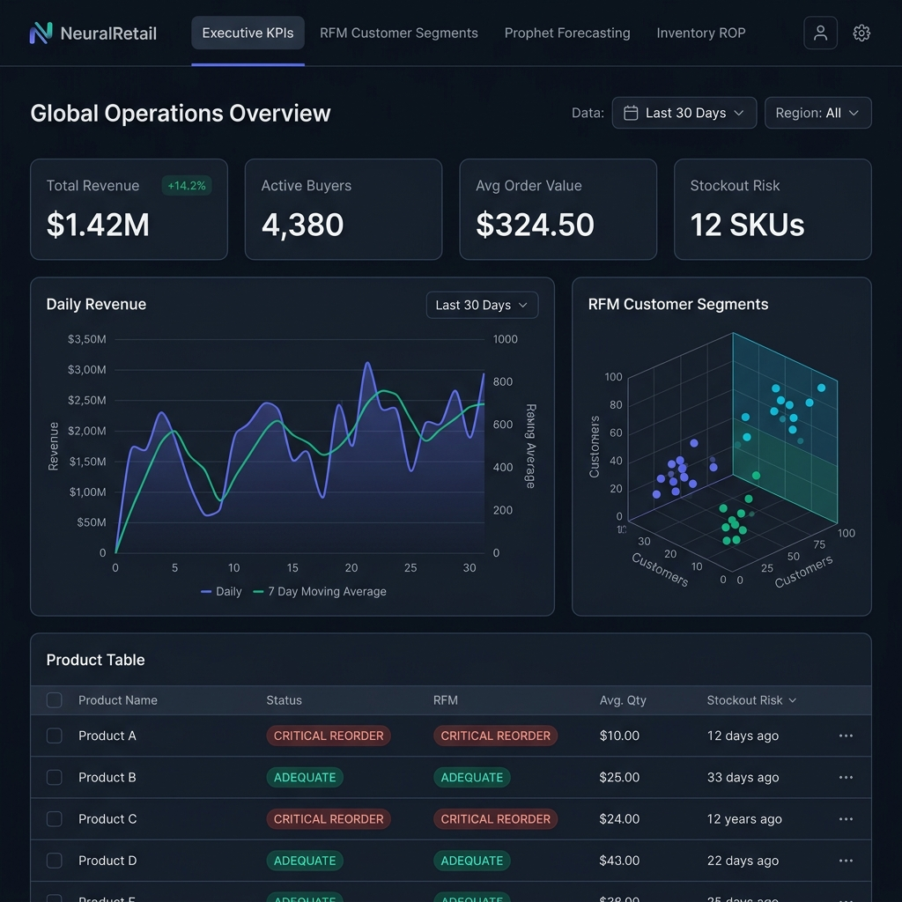
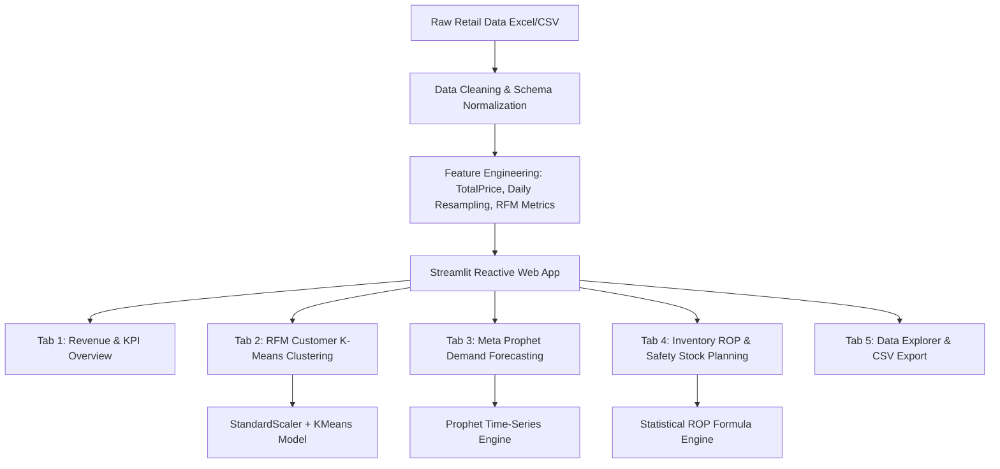

# 🔭 NeuralRetail & RetailPulse: Enterprise AI Retail Analytics Platform



[](https://www.python.org/)
[](https://streamlit.io/)
[](https://scikit-learn.org/)
[](https://facebook.github.io/prophet/)
[](https://xgboost.readthedocs.io/)
[](https://plotly.com/)
[](https://www.docker.com/)
[](LICENSE)

> **NeuralRetail / RetailPulse** is an enterprise-grade, end-to-end Data Science, Machine Learning, and Business Intelligence web application built with **Python**, **Streamlit**, and **Scikit-Learn / Meta Prophet**. It transforms raw e-commerce transaction data into actionable decision-making metrics—enabling real-time KPI tracking, dynamic RFM customer segmentation, AI-powered time-series demand forecasting, and automated inventory stockout risk prevention.

---

## 🛠️ Complete Technology Stack & Architecture

NeuralRetail leverages a modern, robust data science stack engineered for performance, scalability, and interactive data visualization.

| Component / Layer | Technology / Library | Version | Purpose & Technical Function |
| :--- | :--- | :--- | :--- |
| **Frontend Framework** | `Streamlit` | `>= 1.28.0` | Powers the reactive web interface, tabbed navigation, sidebar controls, dynamic metrics, and session state. |
| **Custom Styling** | `HTML5 / CSS3` | Native | Pink Theme Luminous theme with soft pink gradients, glassmorphism cards, micro-animations, and elevated UI hierarchy. |
| **Data Processing** | `Pandas` | `>= 2.0.0` | Performs data manipulation, daily time-series resampling (`resample('D')`), groupby aggregations, and datatypes normalization. |
| **Numeric Engine** | `NumPy` | `>= 1.24.0` | Fast vector operations, logarithmic transformations (`np.log1p`), array math, and metric calculations. |
| **Excel Parser** | `OpenPyXL` | `>= 3.1.0` | Engine for reading `.xlsx` e-commerce spreadsheet files. |
| **Machine Learning** | `Scikit-Learn` | `>= 1.3.0` | Features `StandardScaler` normalization, `KMeans` clustering for customer segmentation, and `silhouette_score` evaluation. |
| **AI Time-Series** | `Meta Prophet` | `>= 1.1.4` | Additive time-series forecasting model handling trend changepoints, daily seasonality, zero-filled non-trading dates, and confidence bands. |
| **Predictive Benchmark** | `XGBoost` | `>= 1.7.0` | Extreme Gradient Boosting engine used for benchmark regression tasks. |
| **Interactive Visuals** | `Plotly Express / Graph Objects` | `>= 5.15.0` | Renders interactive 3D scatter plots, dynamic line charts, dual-axis trend graphs, and hover tooltips. |
| **Static Graphics** | `Matplotlib` & `Seaborn` | `>= 3.7.0` | Clean enterprise whitegrid-styled static visual distributions. |
| **DevOps & Deploy** | `Docker` & `Streamlit Cloud` | Cross-platform | Containerized deployment configuration and cloud hosting support. |

---

## 🌟 Key Platform Features & Modules

### 📊 1. Executive Revenue & Sales Dashboard
- **Real-Time Enterprise KPIs**: Track Total Revenue ($), Total Completed Invoices, Active Unique Buyers, and Average Order Value (AOV).
- **Dynamic Daily Revenue Trends**: Interactive revenue line charts overlaid with a 7-Day Moving Average (MA) to smooth out weekly seasonality.
- **Geographic Breakdown**: Multi-country revenue distribution comparison and regional market analysis.
- **Top Product Performance**: Highlights top 10 best-selling items by both sales volume (quantity) and revenue generated.

### 👥 2. Dynamic RFM Customer Segmentation (K-Means Machine Learning)
- **RFM Metric Calculation**:
  - **Recency ($R$)**: Days elapsed since customer's last invoice date.
  - **Frequency ($F$)**: Count of unique completed purchases.
  - **Monetary ($M$)**: Total revenue spend generated by the customer.
- **Machine Learning Pipeline**:
  1. Applies Logarithmic Transformation $\log(1 + x)$ to handle heavily skewed RFM distributions.
  2. Standardizes features using `StandardScaler` ($\mu=0, \sigma=1$).
  3. Clusters customer profiles using `KMeans` with automatic `silhouette_score` evaluation.
  4. Profiles clusters into actionable tiers: **Champions 👑**, **Loyal Customers 🌟**, **Potential / Core 🎯**, and **At-Risk / Dormant ⚠️**.
- **Interactive 3D Visualization**: Plotly 3D scatter plot of Recency vs Frequency vs Monetary with exportable segment CSV tables.

### 🔮 3. AI-Powered Demand & Revenue Forecasting (Meta Prophet)
- **Continuous Time-Series Ingestion**: Resamples transaction logs to daily totals, automatically backfilling missing non-trading days with zero revenue to avoid structural bias.
- **Flexible Horizons**: Forecast **7, 14, 30, 60, or 90 days** into the future for both **Revenue ($)** and **Order Volume (Invoices)**.
- **Contiguous Projections**: Seamless visual transition from historical trendlines into future predictions, complete with 80% confidence interval upper and lower error bounds ($yhat_{\text{lower}}, yhat_{\text{upper}}$).

### 📦 4. Automated Inventory & Safety Stock Planning (Reorder Point ROP)
- **Sales Velocity**: Calculates average daily consumption rate per product over the historical trading window.
- **Statistical Safety Stock & ROP Formulas**:
  $$\text{Safety Stock} = Z \times \sigma_{\text{daily}} \times \sqrt{\text{Lead Time}}$$
  $$\text{Reorder Point (ROP)} = (\text{Daily Velocity} \times \text{Lead Time}) + \text{Safety Stock}$$
- **Stockout Risk Badging**: Automatically flags inventory items into clear operational categories:
  - 🔴 **CRITICAL REORDER**: Current stock below Reorder Point.
  - 🟡 **WARNING ROP**: Current stock approaching safety threshold.
  - 🟢 **ADEQUATE**: Stock levels sufficient for current lead time window.

### 🔍 5. Interactive Data Explorer & CSV Export
- Searchable, paginated transaction data viewer with multi-column filtering.
- One-click CSV export functionality for reporting and downstream BI integration (PowerBI / Tableau).

---

## 📐 Mathematical & Statistical Formulations

### 1. RFM Feature Standardization & Log Transform
$$\tilde{X} = \ln(1 + X)$$
$$Z = \frac{\tilde{X} - \mu_{\tilde{X}}}{\sigma_{\tilde{X}}}$$

### 2. Prophet Additive Time-Series Equation
$$y(t) = g(t) + s(t) + h(t) + \epsilon_t$$
*where $g(t)$ represents piecewise linear trend, $s(t)$ accounts for periodic seasonality, $h(t)$ accounts for holiday effects, and $\epsilon_t$ is normally distributed error.*

### 3. Reorder Point (ROP) Formula
$$\text{ROP} = (d \times L) + Z \times \sigma_d \times \sqrt{L}$$
*where $d$ is average daily demand velocity, $L$ is lead time in days, $\sigma_d$ is standard deviation of daily demand, and $Z$ is normal distribution Z-score for desired service level.*

---

## 🏗️ System Pipeline Architecture



---

## 📁 Repository Structure

```
ZidioDataScience/
├── NeuralRetail_app.py         # Main enterprise Streamlit web application
├── RetailPulse.py              # Alternative lightweight Streamlit implementation
├── requirements.txt            # Python dependencies with version bounds
├── LICENSE                     # MIT Open Source License
├── README.md                   # Comprehensive platform documentation
├── Command.txt                 # Launch reference commands
├── RetailPulse Architecture.txt# System architecture notes
├── RetailPulse PowerBI Dashboards.txt # PowerBI dashboard specifications
├── docs/
│   ├── neuralretail_hero.png   # Top-class visual header banner
│   ├── neuralretail_demo.gif   # UI animation preview
│   └── neuralretail_preview.png# Dashboard screenshot preview
└── data/
    └── raw/
        └── online_retail.xlsx  # Primary transaction dataset (~45.6 MB)
```

---

## 🚀 Quickstart Guide

### Prerequisites
- **Python 3.9+** installed on your system.
- Git (optional, for cloning).

### 1. Clone or Open the Repository
```bash
git clone https://github.com/heyyypalak/ZidioDataScience.git
cd ZidioDataScience
```

### 2. Create & Activate Virtual Environment
```bash
# On Windows (PowerShell)
python -m venv .venv
.venv\Scripts\activate

# On macOS / Linux
python3 -m venv .venv
source .venv/bin/activate
```

### 3. Install Dependencies
```bash
pip install -r requirements.txt
```

### 4. Run the Application
```bash
streamlit run NeuralRetail_app.py
```
*The app will automatically open in your default browser at `http://localhost:8501`.*

---

## 🐳 Docker Deployment Guide

To containerize and deploy NeuralRetail using Docker:

### 1. Create a `Dockerfile`:
```dockerfile
FROM python:3.11-slim

WORKDIR /app

RUN apt-get update && apt-get install -y \
    build-essential \
    curl \
    software-properties-common \
    && rm -rf /var/lib/apt/lists/*

COPY requirements.txt .
RUN pip install --no-cache-dir -r requirements.txt

COPY . .

EXPOSE 8501

HEALTHCHECK CMD curl --fail http://localhost:8501/_stcore/health

ENTRYPOINT ["streamlit", "run", "NeuralRetail_app.py", "--server.port=8501", "--server.address=0.0.0.0"]
```

### 2. Build and Run Container
```bash
docker build -t neuralretail-app .
docker run -p 8501:8501 neuralretail-app
```

---

## 🌐 Deployment to Streamlit Community Cloud

1. Push this repository to **GitHub**.
2. Go to [share.streamlit.io](https://share.streamlit.io/).
3. Connect your GitHub account and click **New App**.
4. Select repository: `ut3av/ZidioDataScience`.
5. Set **Main file path** to `NeuralRetail_app.py`.
6. Click **Deploy**!

---

## 📄 License

This project is licensed under the **MIT License** - see the [LICENSE](LICENSE) file for details.

---

## 🤝 Contributing & Support

Contributions, issues, and feature requests are welcome! Feel free to open an issue or submit a pull request.

*Built for data-driven retail analytics, customer intelligence, and automated inventory optimization.*
