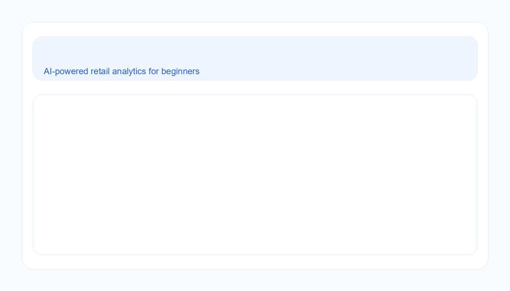
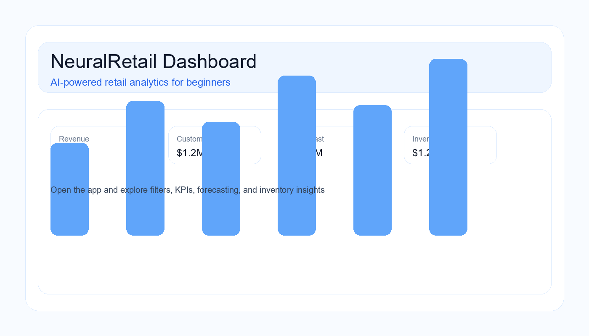

# NeuralRetail Dashboard

Welcome to the NeuralRetail Dashboard project. This repository contains a beginner-friendly retail analytics app built with Python and Streamlit. It helps you understand sales performance, customer behavior, forecasting, and inventory planning using a simple web dashboard.



## What is this project?

This project is a retail intelligence dashboard. It turns raw transaction data into useful business insights.

In simple terms, it helps a business answer questions like:
- Which countries are generating the most revenue?
- Which products are selling well?
- Which customers are most valuable?
- What might sales look like in the next 30 days?
- Which products may need more stock?

## Why this project matters

Retail companies deal with a large amount of transaction data every day. Without analysis, this data is just numbers. This app helps convert that data into:
- clear business metrics
- interactive visual reports
- simple forecasting
- customer segmentation
- inventory recommendations

## Main features

- Loads retail sales data from Excel or CSV files
- Cleans and standardizes important columns
- Calculates total price automatically
- Provides filters for country, date range, product, and search text
- Shows useful KPIs such as revenue, order count, and average order value
- Segments customers into groups such as champions, potential, at-risk, and new/low-value customers
- Creates a 30-day sales forecast
- Suggests inventory-related actions
- Displays data in an easy-to-use Streamlit dashboard

## Demo preview



## Project structure

- NeuralRetail_app.py – the main Streamlit dashboard app
- requirements.txt – Python libraries needed to run the app
- data/raw/ – folder where your raw retail data file should be placed
- docs/ – images and demo assets for this README
- .venv/ – local virtual environment for running the app

## Data requirement

Place your retail dataset in the folder below:

- data/raw/online_retail.xlsx

If the Excel file is not found, the app will try to find the first CSV or XLSX file in the data/raw folder.

## How to run this project locally

If you are new to Python, follow these steps carefully.

### 1. Open the project folder
```bash
cd c:\Users\palak\intern_course
```

### 2. Create and activate a virtual environment
If you already have the virtual environment in this folder, you can use it directly.

```bash
c:\Users\palak\intern_course\.venv\Scripts\python.exe -m venv .venv
```

### 3. Install dependencies
```bash
c:\Users\palak\intern_course\.venv\Scripts\python.exe -m pip install -r requirements.txt
```

### 4. Start the app
```bash
c:\Users\palak\intern_course\.venv\Scripts\python.exe -m streamlit run NeuralRetail_app.py
```

After running the command, Streamlit will open the app in your browser.

## How to use the dashboard

Once the app is running:
1. Open the sidebar filters.
2. Choose one or more countries.
3. Pick a date range.
4. Filter by product or search text.
5. Review the KPI cards and charts.
6. Explore forecast and inventory suggestions.

This helps you focus the dashboard on the part of the business you want to understand.

## Beginner-friendly explanation of the main files

- NeuralRetail_app.py
  - This is the main application file.
  - It loads the data, prepares it, and builds the dashboard UI.
  - It contains the charts, metrics, filters, and forecasting logic.

- requirements.txt
  - This file lists all Python libraries needed to run the project.
  - If something is missing, install it from here.

- data/raw/
  - This is the folder where your raw dataset should be stored.
  - The app expects retail transaction data in Excel or CSV format.

## Git and GitHub guide

If you are using Git for the first time, these commands will help you:

```bash
git status
git add .
git commit -m "Updated dashboard README"
git push
```

If you want to create a new branch:

```bash
git checkout -b feature/my-update
```

## Troubleshooting

If the app does not start:
- Make sure Python is installed.
- Make sure the virtual environment exists.
- Make sure all packages from requirements.txt are installed.
- Make sure the data file exists in data/raw/.

If you see an error about missing modules, run:

```bash
c:\Users\palak\intern_course\.venv\Scripts\python.exe -m pip install -r requirements.txt
```

## Future improvements

Possible next steps for this project:
- Add more advanced forecasting models
- Improve visual design
- Add user authentication
- Connect to a real database
- Deploy to Streamlit Cloud or Azure

## Summary

This project is a practical introduction to data science, machine learning, and business analytics using Python. It is a great example of how raw data can be transformed into meaningful insights for retail decision-making.
